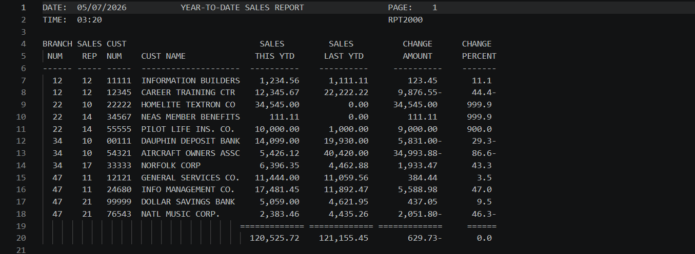
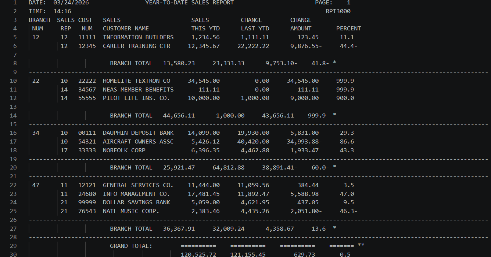
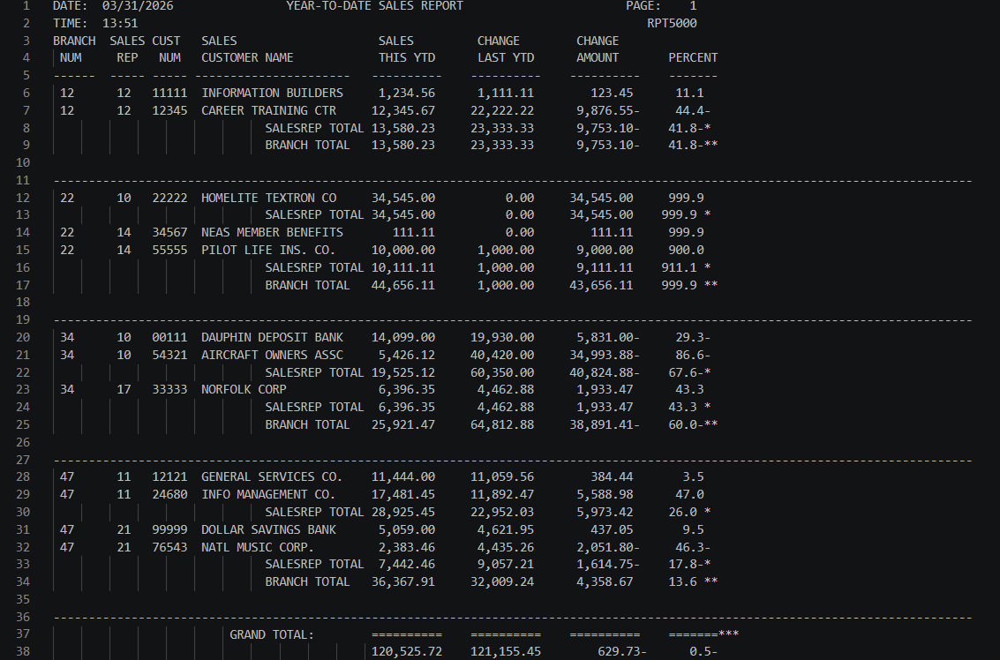
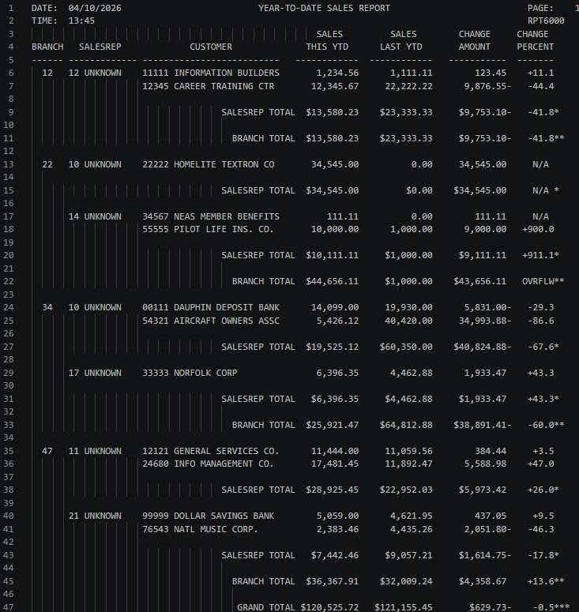
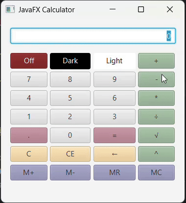

# COBOL Developer Gateway
- Author: Kayley Wells
- Course: Intro to Enterprise Computing

## About Me
I am currently studying Computer Information Systems - Networking & Cybersecurity at WSC. This repository is a portfolio of assignments and projects completed throughout my academic career.

## Profile
<p align="center">
  
</p>
<h3 align="center">Kayley Wells</h3>
<p align="center">
  <a href="https://github.com/kayley-wells">GitHub</a> •
  <a href="mailto:kawell03@wsc.edu">Email</a> •
  <a href="https://www.linkedin.com/in/kayley-wells-a2a503350/">LinkedIn</a>
</p>

## Table of Contents
| Project Name | Coding Lanugage | Course | Description | Repository Link |
|---------|------|----------|-------------|------|
| [RPT2000](#RPT2000) | COBOL / JCL | Intro to Enterprise Computing | Batch reporting program that reads the Customer Master File and produces a formatted Year-to-Date Sales Report. | [RPT2000](https://github.com/kayley-wells/RPT2000) |
| [RPT3000](#RPT3000) | COBOL / JCL | Intro to Enterprise Computing | Calculates the amount changed for a customer's sales from the previous year compared to the present year. | [RPT3000](https://github.com/kayley-wells/RPT3000)|
| [RPT5000](#COBOL_RPT5000) | COBOL / JCL | Intro to Enterprise Computing | Generates a Year-To-Date Sales Report that compares each customer's sales figures from the current year against the previous year. | [RPT5000](https://github.com/kayley-wells/RPT5000)|
| [RPT6000](#RPT6000) | COBOL / JCL | Intro to Enterprise Computing | Batch reporting program that reads the Customer Master File and Sales Rep Master File to produce a formatted Year-to-Date Sales Report. | [RPT6000](https://github.com/kayley-wells/RPT6000)|
| [CALC2000](#CALC2000) | COBOL / JCL | Intro to Enterprise Computing | Calculates the future value of an investment using a fixed annual interest rate over a fixed number of years. | [CALC2000](https://github.com/kayley-wells/CALC2000)|
| [SEQ3000](#SEQ3000) | COBOL / JCL | Intro to Enterprise Computing | A multi-program COBOL project designed to create, maintain, and update employee records using both sequential and indexed file processing techniques. | [SEQ3000](https://github.com/kayley-wells/SEQ3000)|
| [JAVAFXCalculator](#JAVAFXCalculator) | Java | Programming Fundamentals II | JavaFX-based application that allows users to interact with a calculator using the last user's entry or total using memory. | [JAVAFXCalculator](https://github.com/kayley-wells/JavaFXCalculator) |
| [MathTutorV6](#MathTutorV6) | C++ | Programming Fundamentals I | An interactive math tutor designed for young children. | [MathTutorV6](https://github.com/kayley-wells/MathTutorV6) |

## RPT2000
RPT2000 is a COBOL batch reporting program that reads the Customer Master File and produces a formatted Year-to-Date Sales Report. The report includes each customer's current and prior year sales figures, along with a calculated change amount and change percent for performance comparison.

Software Used:
- COBOL Enterprise
- VSCode
- GitHub

✅ Completed
[RPT2000 Repository](https://github.com/kayley-wells/RPT2000)

Output Example:
<p align="left">
  
</p>

[To Table of Contents](#table-of-contents)

## RPT3000
This COBOL program calculates the amount changed for a customer's sales from the previous year compared to the present year. It then subsequently calculates the percentage change as well.

Software Used:
- COBOL Enterprise
- VSCode
- GitHub

✅ Completed
[RPT3000 Repository](https://github.com/kayley-wells/RPT3000)

Output Example:
<p align="left">
  
</p>

[To Table of Contents](#table-of-contents)

## RPT5000
This COBOL program generates a Year-To-Date Sales Report that compares each customer's sales figures from the current year against the previous year. It calculates the change in dollar amount and the percentage change between the two periods. The report is organised using a control break structure, producing subtotals at the sales representative level and the branch level, as well as a grand total across all branches.

Software Used:
- COBOL Enterprise
- VSCode
- GitHub

✅ Completed
[RPT5000 Repository](https://github.com/kayley-wells/RPT5000)

Output Example:
<p align="left">
  
</p>

[To Table of Contents](#table-of-contents)

## RPT6000
RPT6000 is a COBOL batch reporting program that reads the Customer Master File and Sales Rep Master File to produce a formatted Year-to-Date Sales Report. The report includes each customer's current and prior year sales figures, along with a calculated change amount and change percent for performance comparison.

Software Used:
- COBOL Enterprise
- VSCode
- GitHub

✅ Completed
[RPT6000 Repository](https://github.com/kayley-wells/RPT6000)

Output Example:
<p align="left">
  
</p>

[To Table of Contents](#table-of-contents)
## CALC2000
A small COBOL program that calculates the future value of an investment using a fixed annual interest rateover a fixed number of years. After the first calculation, it doubles the investment amount twice, recalculating the future value each time.

Software Used:
- COBOL Enterprise
- VSCode
- GitHub

✅ Completed
[CALC2000 Repository](https://github.com/kayley-wells/CALC2000)

Output Example:
```
Calculating Future Values.
  ----------------------------
    Investment Amount =      1,000
    Number of Years   = 10
    Yearly Interest   = 5.5
    Future Value      =  1,708.16
  ----------------------------
  ----------------------------
    Investment Amount =      2,000
    Number of Years   = 10
    Yearly Interest   = 5.5
    Future Value      =  3,416.29
  ----------------------------
  ----------------------------
    Investment Amount =      4,000
    Number of Years   = 10
    Yearly Interest   = 5.5
    Future Value      =  6,832.58
  ----------------------------
```

[To Table of Contents](#table-of-contents)
## SEQ3000
The COBOL EMPLOYEE SYSTEM is a multi-program COBOL project designed to create, maintain, and update employee records using both sequential and indexed file processing techniques.

This system expands across multiple programs that work together to simulate real-world batch and online-style file maintenance. It includes initial file creation, sequential transaction processing, and indexed file maintenance with error handling. The programs demonstrate how employee data can be added, updated, deleted, and validated across different storage structures.

The system produces updated employee master files while also capturing invalid transactions for auditing and debugging purposes.

Software Used:
- COBOL Enterprise
- VSCode
- GitHub

✅ Completed
[SEQ3000 Repository](https://github.com/kayley-wells/SEQ3000)

Output Example for Employee File:
```
10008ROBERT DAVIS                  HR   H3065000{08003000
10012MARY WILLIAMS                 ACCT A1055000005002000
```

[To Table of Contents](#table-of-contents)
## JavaFXCalculator
The JavaFX Calculator is a JavaFX-based application that allows users to interact with a calculator using the last user's entry or total using memory. The application provides functionalities to add, multiply, divide, calculate exponents, and calculate square roots.

Software Used:
- IntelliJ IDEA
- Amazon Corretto
- Java 17
- GitHub

✅ Completed
[JavaFXCalculator Repository](https://github.com/kayley-wells/JavaFXCalculator)

Output Example:
<p align="left">
  
</p>

[To Table of Contents](#table-of-contents)
## MathTutorV6
V6 is an interactive math tutor for young children that generates random math problems and dynamically adjusts difficulty based on the user's performance — leveling up with correct answers and down with incorrect ones. It collects the user's name, tracks their progress throughout the session, and provides encouraging feedback along the way. Once finished, the program displays a summary report showing which questions were answered correctly and incorrectly. It also supports saving and loading progress so users can pick up where they left off.

Software Used:
- CLion
- GitHub

✅ Completed
[MathTutorV6 Repository](https://github.com/kayley-wells/MathTutorV6)

Output Example:
```
************************************************************
 _   _      _        __       _   __  __       _   _
| | | | ___| |_ __  / _|_   _| | |  \/  | __ _| |_| |__
| |_| |/ _ \ | '_ \| |_| | | | | | |\/| |/ _` | __| '_ \
|  _  |  __/ | |_) |  _| |_| | | | |  | | (_| | |_| | | |
|_| |_|\___|_| .__/|_|  \__,_|_| |_|  |_|\__,_|\__|_| |_|
|_   _|   _| |_|___  _ __
  | || | | | __/ _ \| '__|
  | || |_| | || (_) | |
  |_| \__,_|\__\___/|_|
*************************************************************
*             Welcome to the Helpful Math Tutor             *
*           This will quiz you on your Math skills.         *
************************************************************
Intersting Math Facts:
     *The sum of opposite on a standard die is always 7!
     *1000 is the only number from 0 to 1000 that has an a in it!
     *1,089 X 9 = 9,801
     *111,111,111 X 111,111,111 = 12,345,678,987,654,321
************************************************************


Enter your name:Kayley

Hello Kayley, welcome to Math Tutor!
[Level #1]Kayley what is 4 * 2?
8

Congrats! You are correct!
Thank you for playing the game!
Do you want to continue (y=yes | n=no)?y

[Level #1]Kayley what is 5 - 4?
1

Congrats! You are correct!
Thank you for playing the game!
Do you want to continue (y=yes | n=no)?y

[Level #1]Kayley what is 8 - 6?
2

Congrats! You are correct!
Thank you for playing the game!
Congrats! You have upgraded to Level: 2
The numbers are now between 1 and 20
Do you want to continue (y=yes | n=no)?n

===================================
          Summary Report
===================================
Level      Question      Attempts
----- ------------------ ---------
   1    4 * 2  =    8        1
   1    5 - 4  =    1        1
   1    8 - 6  =    2        1

Total Questions:    3
Total Correct:      3
Total Incorrect:    0
Average:          100%

Good work, Kayley!Do you want to continue (y=yes | n=no)?y

Saving game, please wait...
0 questions were successfully saved to the file.
Do you want to continue (y=yes | n=no)?y

Loading game, please wait...
0 questions were successfully saved to the file.

Process finished with exit code -1073741795 (0xC000001D)

```
[To Table of Contents](#table-of-contents)
